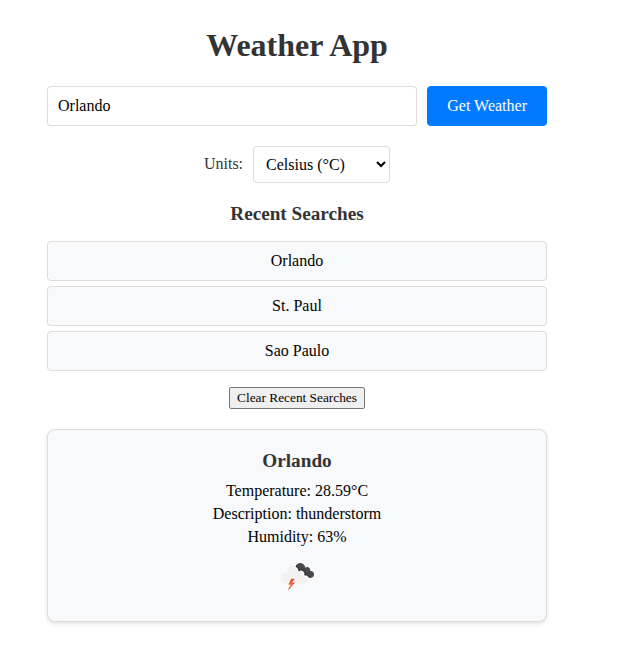

# Weather

## Description

A simple Weather application built with **Angular** and **SCSS**. Users can enter a city name to view current weather data (temperature, description, humidity) fetched from the OpenWeatherMap API’s free-tier Current Weather Data endpoint. The app persists the last searched city, recent searches, and unit preference (Celsius/Fahrenheit) in `localStorage` and handles errors for invalid inputs.

## Table of Contents 

* [Installation](#installation)

* [Usage](#usage)

* [License](#license)

* [Dependencies](#dependencies)

* [Tests](#tests)

* [Questions](#questions)

## Installation

To install necessary dependencies, run the following command:

`npm i`

## Usage

- Enter a city name (e.g., “Miami”) and click “Get Weather”.

- View weather details (temperature, description, humidity, icon).

- Toggle between Celsius (°C) and Fahrenheit (°F) using the unit dropdown.

- Click a city from the “Recent Searches” list to fetch its weather.

- Recent searches (up to 5), last searched city, and unit preference persist across refreshes.

- See error messages for invalid cities or API issues (e.g., invalid key).

## License

This project is licensed under the MIT license.
  
## Dependencies
- Angular: v17+ (see package.json)

- Sass: For SCSS compilation

- HttpClient: Provided via provideHttpClient() in main.ts

- FormsModule: For input and dropdown binding

- CommonModule: For *ngIf and *ngFor

## Questions
You can find more of my work at [austinslatey](https://github.com/austinslatey/).

